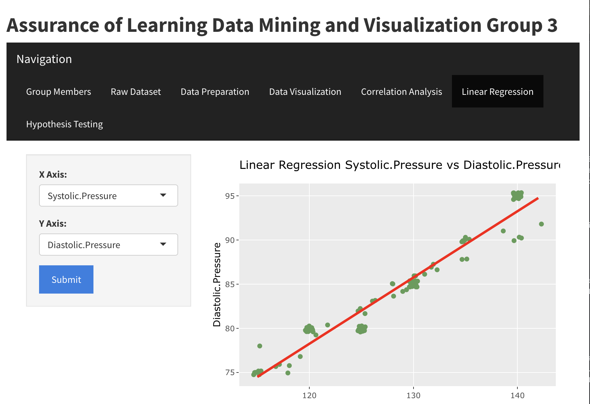

# Sleep Health & Lifestyle Dashboard

## Summary
This project is an interactive web application built using R Shiny to allow users to explore and analyze the sleep health lifestyle dataset, it provide tabs for data exploration, visualization, and statistical modeling. This model is made for classifying person sleep disorders factor happen by many factor such as age, sleep duration, stress level, occupation, BMI category, daily steps, and etc

## Problem
1. Allow users to visually explore how variables like occupation, stress level, and BMI relate to sleep quality
2. Provide a simple, code-free interface for users to perform statistical analysis to get immediate feedback on variable correlations

## Methodology
1. EDA & Preprocessing (checking category variable anomaly, feature engineering (systolic, diastolic, tension category, outliers)
2. App Development navigation bar page (About, Dataset, Visualization, Modeling)
3. Visualization
4. Modeling
5. Deploy Shiny

## Skills
1. R language: Data cleaning and manipulation using dplyr, visualization with ggplot2, and statistical modeling using lm(2)
2. Web App & Backend (Shiny): Build an interactive multi-tab UI with shiny and shinythemes using ui.R and etc
3. Reactivity (Shiny): Using server.R to dynamically update plots and model summaries based on user input

## Results

1. A functional real-time dashboard to allows non-technical users to explore
2. Interactive visualizations that help users immediately see the distribution and correlation between different lifestyle and sleep health factors

## Next Steps
1. Add more advanced modeling options such as logistic regression to predict categorical outcomes like sleep disorder
2. Dsploy the app to make it publicly accessible for users to interact with
